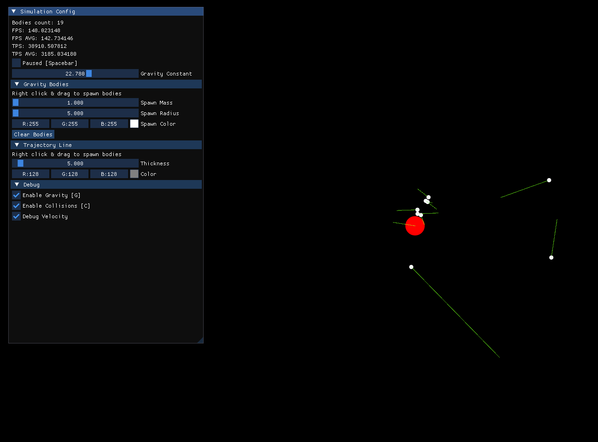

# GravSim [WIP]
Gravity simulation for circular objects using [Newton's law of universal gravitation](https://en.wikipedia.org/wiki/Newton%27s_law_of_universal_gravitation)
and some other physics formulas


## Downloads
Get latest release from [releases](https://github.com/ultraflame4/GravSim/releases).
You can also install from itch.io https://notlivingstudios.itch.io/gravsim


## Controls
[Space] - Pause <br/>
[W] - Move camera up <br/>
[A] - Move camera left <br/>
[S] - Move camera down <br/>
[D] - Move camera right <br/>
[Right Click + drag] Spawn object with velocity ( velocity depends on direction and distance of drag) <br/>

## Building

### Prerequisites
To build this project, you will need:
1. clang or a compiler with C++23 support (eg. clang)
2. cmake version 3.26 and above
3. ninja (or any other cmake supported build system)

### Instructions
The following instructions will assume you are using `ninja` as your build system
1. First install ninja. See [here](https://github.com/ninja-build/ninja/wiki/Pre-built-Ninja-packages) for instructions

2. Secondly clone this repository and its submodules:
```shell
git clone https://github.com/ultraflame4/GravSim.git --recursive --depth=1
```
2. Use cmake to generate project build files.
```shell
cmake -S . -B build -G Ninja
```
3. Build the project with.
```shell
cmake --build build
```
4. Run the executable `GravSim.exe` in the build folder

## Notes:
1. The collision physics is very buggy.
2. Spawning too many bodies will make them disappear. I have no idea why.
